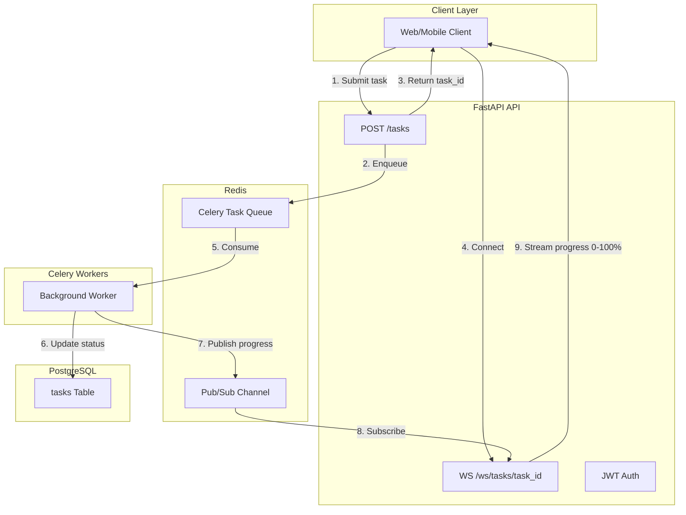

# Distributed Task & Notification Engine

A production-grade API for submitting heavy background tasks with real-time WebSocket progress updates. Built for high-concurrency workloads with modular architecture.

## Architecture



## Tech Stack

- **Framework:** FastAPI (Async) with Pydantic v2
- **Database:** PostgreSQL with SQLAlchemy 2.0 (Async) and Alembic
- **Task Queue:** Redis + Celery
- **Real-time:** WebSockets with Redis Pub/Sub
- **Security:** JWT (HS256) + Argon2 password hashing
- **Deployment:** Docker Compose, Render Blueprint

## Project Structure

```
app/
  api/         # Routes and dependencies
  core/        # Config, security, Celery, Redis Pub/Sub
  models/      # SQLAlchemy models
  schemas/     # Pydantic schemas
  repositories/# Data access layer
  services/    # Business logic
  db/          # Database session
workers/       # Celery task definitions
alembic/       # Migrations
tests/         # Pytest integration tests
```

## Quick Start

### Prerequisites

- Docker and Docker Compose
- Python 3.12+ (for local development)

### Run with Docker

```bash
cp .env.example .env
docker-compose up --build
```

API: http://localhost:8000  
Docs: http://localhost:8000/docs

### Local Development

```bash
python -m venv .venv
.venv\Scripts\activate   # Windows
# source .venv/bin/activate  # Unix
pip install -r requirements.txt
cp .env.example .env
# Start Postgres and Redis (e.g. docker-compose up postgres redis)
alembic upgrade head
uvicorn app.main:app --reload
celery -A app.core.celery_app worker --loglevel=info   # In another terminal
```

## API Summary

| Method | Endpoint | Description |
|--------|----------|-------------|
| POST | `/api/v1/auth/register` | Register user |
| POST | `/api/v1/auth/login` | Login, get JWT |
| POST | `/api/v1/tasks` | Create task (auth required) |
| GET | `/api/v1/tasks/{task_id}` | Get task status (auth required) |
| WS | `/api/v1/ws/tasks/{task_id}?token=<jwt>` | Live progress stream |

### Example Flow

1. **Register/Login:** `POST /api/v1/auth/login` with `{email, password}` → receive `access_token`
2. **Create Task:** `POST /api/v1/tasks` with `Authorization: Bearer <token>` → receive `task_id`
3. **Stream Progress:** Connect WebSocket to `/api/v1/ws/tasks/{task_id}?token=<token>` for 0%→100% updates

## Environment Variables

| Variable | Description | Default |
|----------|-------------|---------|
| `DATABASE_URL` | PostgreSQL async URL | `postgresql+asyncpg://...` |
| `REDIS_URL` | Redis connection | `redis://localhost:6379/0` |
| `CELERY_BROKER_URL` | Celery broker | `redis://localhost:6379/1` |
| `JWT_SECRET_KEY` | JWT signing key | (required in prod) |
| `JWT_ALGORITHM` | JWT algorithm | `HS256` |
| `JWT_EXPIRE_MINUTES` | Token TTL | `60` |
| `PROGRESS_CHANNEL` | Redis Pub/Sub channel | `task:progress` |

## Testing

```bash
# Create test DB: createdb task_engine_test
# Or set TEST_DATABASE_URL
pytest -v
pytest --cov=app
```

Tests mock the Celery broker and Redis Pub/Sub; integration tests verify database state.

## Deployment (Render)

The project includes a fully automated `render.yaml` Blueprint.

**Live Demo (Swagger UI):** [https://task-engine-api.onrender.com/docs](https://task-engine-api.onrender.com/docs)

1. Go to the [Render Dashboard](https://dashboard.render.com/)
2. Click **New +** and select **Blueprint**
3. Connect this repository
4. Click **Apply**

Render will automatically provision the underlying PostgreSQL database, managed Redis instance, the FastAPI web service, and the Celery background worker. All Environment Variables (like `DATABASE_URL`, `REDIS_URL`) are automatically wired.

## Windows Note

The `.gitattributes` file enforces LF line endings for `*.sh` scripts so Docker entrypoints work correctly on Windows (avoids CRLF-related errors).

## License

MIT
